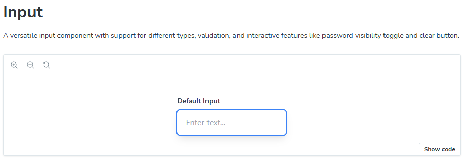
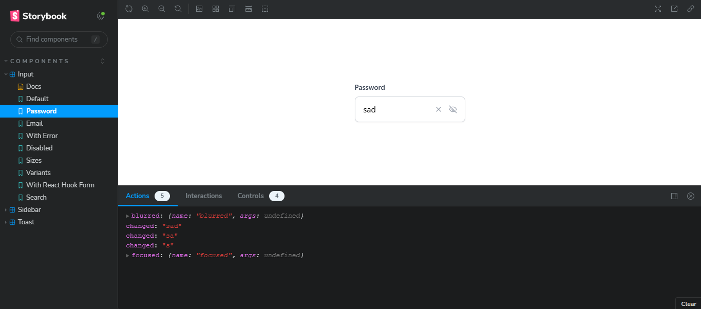
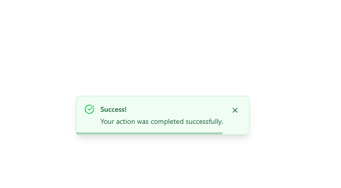
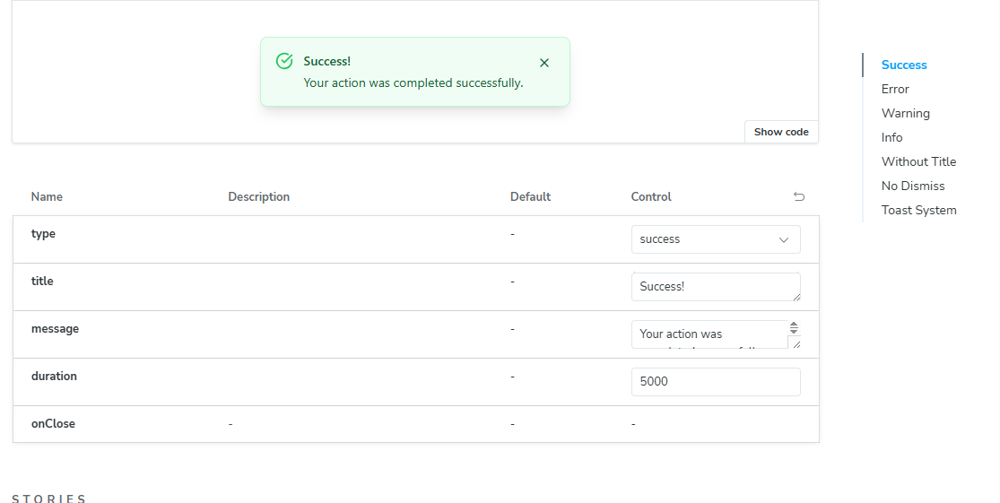
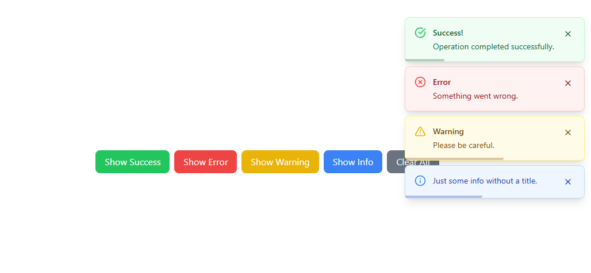
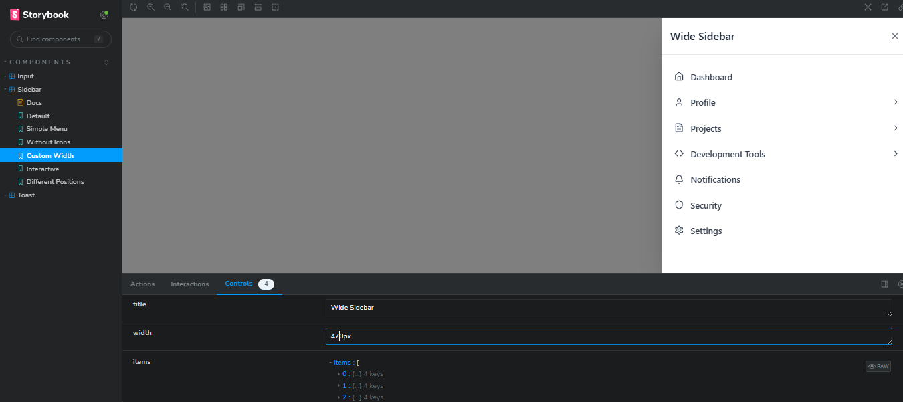

# React UI Component Library

A beautiful, production-ready React component library built with TypeScript, Tailwind CSS, and Framer Motion. This library includes three core components with comprehensive Storybook documentation.

## 🚀 Components

### Input Component

A versatile input component with advanced features:

- Multiple input types (text, password, email, number, tel, url, search)
- Password visibility toggle
- Clear button functionality
- Three sizes (sm, md, lg)
- Three variants (default, outline, filled)
- Error states with validation
- Smooth animations and micro-interactions
- React Hook Form integration support





### Toast Component

A notification system with elegant animations:

- Four types (success, error, warning, info)
- Auto-dismiss with configurable duration
- Manual close button
- Slide and fade animations
- Progress indicator
- Toast container for managing multiple toasts
- Customizable positioning

  
  
  

### Sidebar Component

A sliding navigation menu with advanced features:

- Right-sliding animation
- Nested expandable submenus (up to 2 levels)
- Icon support with Lucide React
- Background click to close
- Smooth animations with Framer Motion
- Customizable width and styling
- Mobile-friendly design




## 🛠️ Tech Stack

- **React 18** with TypeScript
- **Tailwind CSS** for styling
- **Framer Motion** for animations
- **Storybook 7** for component documentation
- **Lucide React** for icons
- **React Hook Form** integration
- **ESLint + Prettier** for code quality

## 📦 Installation & Setup

Clone the repo and install dependencies:

````bash
git clone https://github.com/TrueMolni/StoryBook.git
cd StoryBook
npm install
npm run storybook


## 🎨 Development

Start the development server:
```bash
npm run dev
````

Run Storybook:

```bash
npm run storybook
```

## 📖 Storybook Documentation

Each component includes comprehensive Storybook stories showcasing:

- Default usage
- All component variants and states
- Interactive examples
- React Hook Form integration
- Real-world usage scenarios

## 🏗️ Project Structure

```
src/
├── components/
│   ├── Input/
│   │   ├── Input.tsx
│   │   ├── types.ts
│   │   └── index.ts
│   ├── Toast/
│   │   ├── Toast.tsx
│   │   ├── ToastContainer.tsx
│   │   ├── types.ts
│   │   └── index.ts
│   ├── Sidebar/
│   │   ├── Sidebar.tsx
│   │   ├── types.ts
│   │   └── index.ts
│   └── index.ts
├── stories/
│   ├── Input.stories.tsx
│   ├── Toast.stories.tsx
│   └── Sidebar.stories.tsx
```

## 🎯 Key Features

### Design System

- Consistent 8px spacing system
- Comprehensive color palette with semantic variants
- Apple-level design aesthetics
- Smooth micro-interactions and hover states
- Responsive design principles

### Animation & UX

- Framer Motion animations throughout
- Progressive disclosure for complex UI
- Intuitive user interactions
- Accessibility considerations
- Mobile-first responsive design
- All components use **Framer Motion** for smooth entry/exit and interactive transitions

### Code Quality

- TypeScript interfaces for all components
- ESLint and Prettier configuration
- Clean, modular architecture
- Comprehensive prop validation
- Production-ready code standards

## 📱 Component Usage Examples

### Input Component

```tsx
import { Input } from './components/Input';

<Input
  type="email"
  label="Email Address"
  placeholder="Enter your email..."
  showClearButton={true}
  error={errors.email?.message}
  onChange={(value) => console.log(value)}
/>;
```

### Toast Component

```tsx
import { Toast, ToastContainer } from './components/Toast';

const [toasts, setToasts] = useState([]);

<ToastContainer toasts={toasts} position="top-right" onRemove={removeToast} />;
```

### Sidebar Component

```tsx
import { Sidebar } from './components/Sidebar';

<Sidebar
  isOpen={sidebarOpen}
  onClose={() => setSidebarOpen(false)}
  title="Navigation"
  items={menuItems}
/>;
```

## 🚀 Scripts

- `npm run dev` - Start development server
- `npm run build` - Build for production
- `npm run storybook` - Start Storybook
- `npm run build-storybook` - Build Storybook
- `npm run lint` - Run ESLint
- `npm run lint:fix` - Fix ESLint issues
- `npm run format` - Format with Prettier

## 🎨 Design Philosophy

This component library follows modern design principles:

- **Minimalism**: Clean, uncluttered interfaces
- **Consistency**: Unified spacing, typography, and color systems
- **Accessibility**: Proper contrast ratios and keyboard navigation
- **Performance**: Optimized animations and efficient rendering
- **Flexibility**: Customizable props while maintaining design coherence

## 📋 Component Props

### Input Props

- `type`: Input type (text, password, email, etc.)
- `size`: Component size (sm, md, lg)
- `variant`: Visual variant (default, outline, filled)
- `error`: Error message for validation
- `showClearButton`: Toggle clear button visibility
- `showPasswordToggle`: Toggle password visibility button

### Toast Props

- `type`: Toast type (success, error, warning, info)
- `duration`: Auto-dismiss duration in ms
- `title`: Optional toast title
- `message`: Toast message content
- `showCloseButton`: Toggle close button

### Sidebar Props

- `isOpen`: Controls sidebar visibility
- `items`: Array of menu items with nested structure
- `title`: Sidebar header title
- `width`: Custom sidebar width
- `onClose`: Close callback function

This component library demonstrates modern React development practices with beautiful design, smooth animations, and comprehensive documentation through Storybook.
